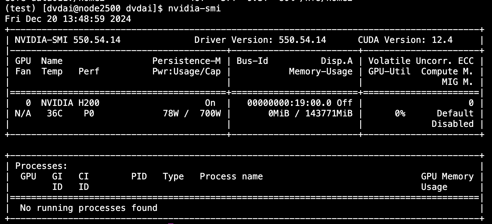

# MIT Engaging Cluster Documentation

## Introduction

The MIT Engaging Cluster is a high-performance computing (HPC) system that provides computational resources for research. This guide will help you get started with accessing and using our lab's resource on the Engaging cluster.

This documentation mainly focuses on commandline access to the server. If you prefer to use Jupyter notebooks, please refer to the [Jupyter Access Guide](jupyter_access.md).

## Getting Started

### Prerequisites

Before you begin, ensure you have:

- An MIT Kerberos account (your MIT username and password)

- A terminal application (Terminal on macOS/Linux, or PuTTY/Windows Terminal on Windows)

- Basic familiarity with Linux command line

### Creating an Engaging Account

You can skip this section if you have used Engaging before. Otherwise, an account can be automatically created for you when you first log in with your MIT credentials.

1. Open your browser and go to [https://engaging-ood.mit.edu/](https://engaging-ood.mit.edu/)

2. Login with MIT credentials

??? note "Troubleshooting login issues"
    If you encounter a traffic error or cannot login:
       1. Clear your browser's cache and cookies
       2. Try using a different browser or incognito/private mode
       3. Ensure you're connected to the MIT network or VPN if off-campus

## Requesting Access to Our Group's Server

Our server's access is currently managed by David. Please follow the following steps to request access:

1. Get approval from Paul. 
2. Email or Slack David at dvdai@mit.edu.
3. Once it's set up, you should be able to request the node in around 30 minutes.

## SSH Access

SSH (Secure Shell) provides command-line access to the cluster, which is suitable for most tasks.

### Basic SSH Connection

To connect via SSH, open your terminal and use:

```bash
ssh <mit_username>@orcd-login001.mit.edu
```

For example, if your MIT username is `dvdai`, you would run:
```bash
ssh dvdai@orcd-login001.mit.edu
```

You'll be prompted for your MIT password. After entering it, you'll be connected to the login node.

!!! note
    The login node is for light tasks only (editing files, submitting jobs). Do NOT run computationally intensive tasks here.

### Password-Free SSH Setup

Typing your password repeatedly can be tedious. Set up SSH keys for password-free access:

```bash
# On your local machine, generate an SSH key if you don't have one
ssh-keygen -t rsa -b 4096

# Copy your key to the cluster
ssh-copy-id <mit_username>@orcd-login001.mit.edu
```

!!! tip
    For detailed SSH key setup, see [SSH Copy ID Documentation](https://www.ssh.com/academy/ssh/copy-id).

### Installing Miniconda/Anaconda

Most users prefer managing their own Python environments. Here's how to setup your Python environment using Miniconda:

```bash
# Create a directory for Miniconda
mkdir -p ~/miniconda3

# Download the installer
wget https://repo.anaconda.com/miniconda/Miniconda3-latest-Linux-x86_64.sh -O ~/miniconda3/miniconda.sh

# Install Miniconda (the -b flag runs in batch mode, -u updates existing installation, -p specifies path)
bash ~/miniconda3/miniconda.sh -b -u -p ~/miniconda3

# Remove the installer to save space
rm ~/miniconda3/miniconda.sh

# Activate Miniconda for current session
source ~/miniconda3/bin/activate

# Initialize conda for all shells (bash, zsh, etc.)
conda init --all
```

!!! success
    After running these commands, close and reopen your terminal. You should see `(base)` before your prompt, indicating conda is active.

### Creating and Managing Conda Environments

Environments allow you to have different versions of packages for different projects without conflicts.

```bash
# Create a new environment with specific Python version
conda create --name myproject python=3.12

# Activate the environment
conda activate myproject

# You can install torch via
pip install torch torchvision
```

## Using Persistent Sessions with tmux

When running long jobs via SSH, your session might disconnect. Use tmux to keep sessions running:

```bash
# Start a new tmux session
tmux

# Or start with a named session
tmux new -s mysession

# Detach from session (keeps it running)
# Press: Ctrl+b, then d

# List active sessions
tmux ls

# Reattach to a session
tmux attach -t mysession

# Kill a session
tmux kill-session -t mysession
```

## Requesting Computational Resources

The cluster uses SLURM to manage computational resources. You request resources, and SLURM allocates them when available.

### Interactive GPU Sessions

For development and testing, request an interactive session with GPU:

```bash
srun --gres=gpu:1 --time=03:05:00 -p pi_ppliang --nodelist=node2500 -c 15 --mem=65G --pty bash
```

**Breaking down the parameters:**

- `--gres=gpu:1`: Number of GPUs (max 8 for our group)
- `--time=03:05:00`: Time limit in HH:MM:SS format (max 168:00:00 = 7 days)
- `-p pi_ppliang`: Partition (queue) name for our research group. Our groups is `pi_ppliang`. If you want to use MIT's free GPUs, use `mit_normal_gpu` instead.
- `--nodelist=node2500`: Specific node to use (optional, remove for any available node)
- `-c 15`: Number of CPU cores (generally 15 cores per GPU is reasonable)
- `--mem=65G`: Memory allocation (max ~250GB per GPU, but be considerate)
- `--pty bash`: Launch an interactive bash shell

### Using MIT's Free GPU Resources

MIT provides free GPUs with shorter time limits for general use:

```bash
srun --gres=gpu:1 --time=06:00:00 -p mit_normal_gpu -c 15 --mem=65G --pty bash
```

The exact GPU and compute resources limit for the free partition varies based on the current load. 

## Checking and Managing Jobs

When requesting resources, your job may not start immediately if resources are unavailable. You can check the current status of your jobs via:

```bash
squeue --me
```

If it says `(Resources)`, it means the requested resources aren't currently available. You can check who is using the resources on our node:

```bash
squeue -w node2500 -o "%.18i %.8u %.8T %.10M %.6D %C %m %b"
```

In general, we ask that you only request what you need, and release resources when you're done. If you see someone is using more than 2 GPUs for a long time, feel free to reach out to them to see if they can release some.

!!! note "Creating a Convenience Function"

    You may add this function to your `~/.bashrc` file to simplify GPU requests:
    
    ```bash
    # Open your bashrc file
    nano ~/.bashrc
    
    # Add this function at the end
    getgpu() {
        local gpu_count="${1:-1}"
        local mem="${2:-32G}"
        local time="${3:-03:05:00}"
        echo "Requesting $gpu_count GPU(s) with $mem memory for $time..."
        srun --mem="$mem" --gres="gpu:$gpu_count" --time="$time" -p pi_ppliang --nodelist=node2500 --pty bash
    }
    
    # Save and exit (Ctrl+X, then Y, then Enter)
    
    # Reload your bashrc
    source ~/.bashrc
    ```

    **Usage examples:**
    ```bash
    # Request 1 GPU with defaults (32G memory, 3:05:00 time)
    getgpu
    
    # Request 2 GPUs with 64G memory
    getgpu 2 64G
    
    # Request 1 GPU with 128G memory for 12 hours
    getgpu 1 128G 12:00:00
    ```

### Verifying GPU Access

Once you have a GPU allocated, verify it's working:

```bash
# Check GPU status
nvidia-smi
```

You should see something like:



This shows GPU utilization, memory usage, and running processes.

## Installing and Testing PyTorch

You can set up PyTorch in your conda environment:

```bash
# Make sure you're in your conda environment
conda activate myproject

# Install PyTorch with CUDA support
pip3 install torch torchvision

# Test the installation
python3 -c "import torch; print(f'CUDA available: {torch.cuda.is_available()}')"
python3 -c "import torch; print(f'Number of GPUs: {torch.cuda.device_count()}')"
python3 -c "import torch; print(f'GPU Name: {torch.cuda.get_device_name(0)}')"
```

!!! success
    If properly configured, you should see:

    - `CUDA available: True`

    - `Number of GPUs: 1` (or more if you requested multiple)

    - `GPU Name: [Your GPU model]`


## Transfer files

Checkout the [File Transfer Guide](/engaging/transfer_files) for instructions on transferring files to/from the cluster.


### Monitoring and Management Commands

Useful commands for monitoring cluster usage:

```bash
# Check all your jobs
squeue --me

# Check specific node utilization
squeue -w node2500 -o "%.18i %.8u %.8T %.10M %.6D %C %m %b"

# Check GPU usage on a node
squeue -h -w node2500 -t R -o "%i %u %t %M %C %b" | grep gpu

# Cancel a job
scancel <job_id>

# Cancel all your jobs
scancel -u $USER

# Check your storage quotas
quota -s

# Find large files in your directories
find ~ -type f -size +1G -exec ls -lh {} \;
```

## Resources

1. **Official Documentation**: [ORCD Docs](https://orcd-docs.mit.edu/)


!!! success
    You're now ready to use the MIT Engaging Cluster! Start with small jobs, test your workflows, and scale up as needed. Happy computing!